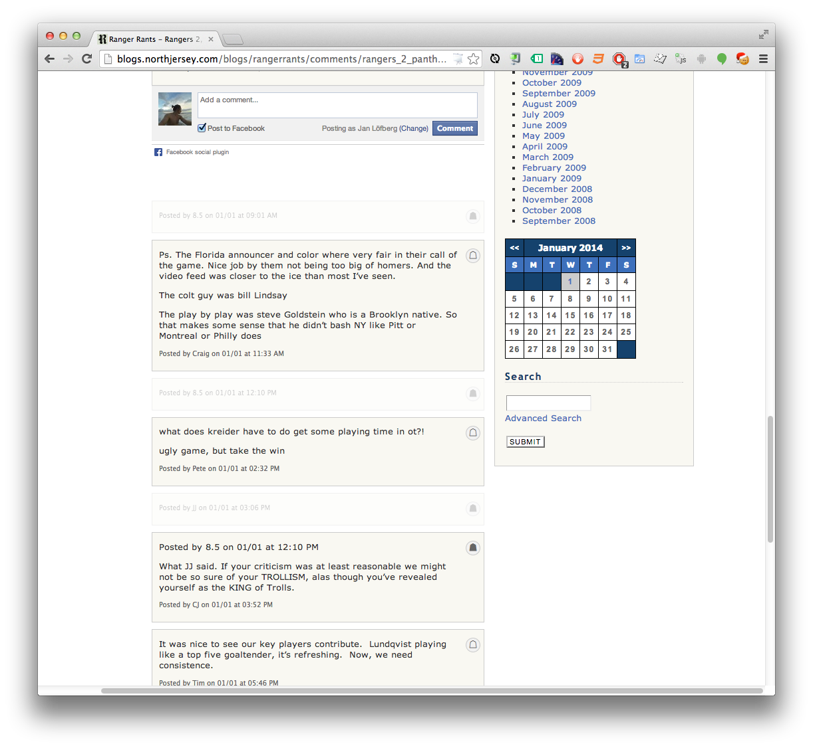

# What is this?

This is a small script that runs locally in your browser. I created it to enable sort of a "troll-block-list" after getting tired of trolls in the comment section. Users added to the "blocked users"-list will be stored in your browsers localStorage. Hence, if you browse the site from a different browser(/computer) than the one you blocked a user on, the user will not appear as blocked in that browser.
No data is neither stored by me nor sent to me.

This script is dependent on the Google Chrome browser and a third party chrome extension called "Personalized Web". This extension will need some permissions to alter web pages on your behalf.

## Installation

* Install the chrome browser extension "[Personalized Web"(https://chrome.google.com/webstore/detail/personalized-web/plcnnpdmhobdfbponjpedobekiogmbco)".
* In your chrome browser, go to chrome://extensions/ (copy and paste into your address field)
* find "Personalized Web", make sure it's enabled
* click on "options" at the bottom of the Personalized Web-section, right next to "allow in incognito"
* click "load dump"
* paste entire content of [`ragsrant_dump.json`](https://raw.github.com/jnaO/ranger_rants/master/ragsrant_dump.json) into the field in the popup
* click ok

## Usage

After the script is installed you will get a new icon top right on every comment post. If you click that icon, you will toggle the blocked status of the user whom written the comment. The comment will then be folded, leaving only the user name visible in a semi opaque comment box.

Now you can toggle the comment by clicking on the comment (anywhere but on the icon top right), and the comment will become visible. Click again to hide.

Solid icon top right indicate that the user is on your blocked list.

# License

The MIT License (MIT)

Copyright (c) [year] [fullname]

Permission is hereby granted, free of charge, to any person obtaining a copy
of this software and associated documentation files (the "Software"), to deal
in the Software without restriction, including without limitation the rights
to use, copy, modify, merge, publish, distribute, sublicense, and/or sell
copies of the Software, and to permit persons to whom the Software is
furnished to do so, subject to the following conditions:

The above copyright notice and this permission notice shall be included in all
copies or substantial portions of the Software.

THE SOFTWARE IS PROVIDED "AS IS", WITHOUT WARRANTY OF ANY KIND, EXPRESS OR
IMPLIED, INCLUDING BUT NOT LIMITED TO THE WARRANTIES OF MERCHANTABILITY,
FITNESS FOR A PARTICULAR PURPOSE AND NONINFRINGEMENT. IN NO EVENT SHALL THE
AUTHORS OR COPYRIGHT HOLDERS BE LIABLE FOR ANY CLAIM, DAMAGES OR OTHER
LIABILITY, WHETHER IN AN ACTION OF CONTRACT, TORT OR OTHERWISE, ARISING FROM,
OUT OF OR IN CONNECTION WITH THE SOFTWARE OR THE USE OR OTHER DEALINGS IN THE
SOFTWARE.